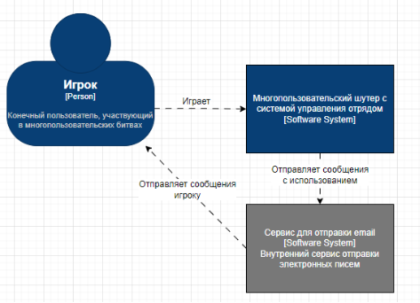
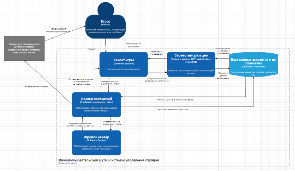
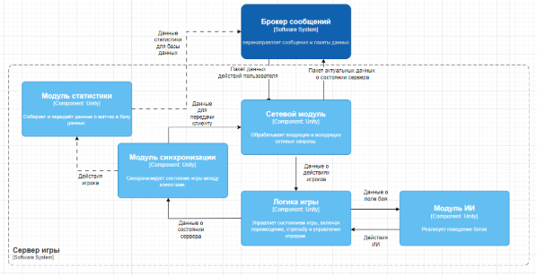
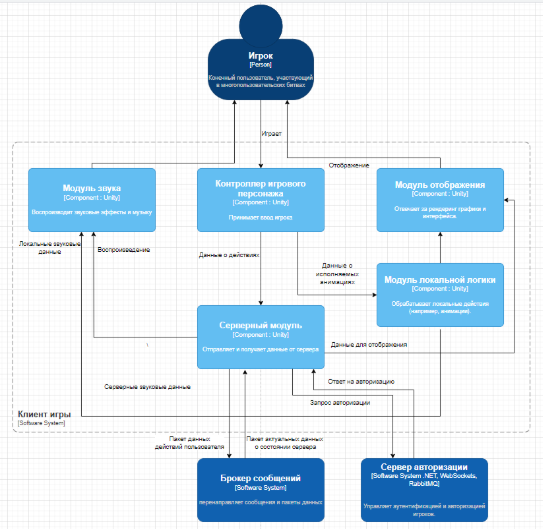

1. # **Диаграмма системного контекста**
   **Описание:**

   Игрок является главным целевым пользователем, он играет в игру. В некоторых случаях, например, при авторизации, игроку могут быть направлено электронное письмо, для этого используется сервис отправки email.

   **Диаграмма:**

   

1. # **Диаграмма контейнеров**

   **Игровой клиент**:

   Отвечает за отображение игры и взаимодействие с игроком.

   **Технологии:** Unity, C#.

   **Игровой сервер:**

   Обрабатывает логику игры, синхронизирует состояние между клиентами.

   **Технологии:** .NET, WebSockets, RabbitMQ

   **Сервер авторизации:**

   Управляет аутентификацией и авторизацией игроков.

   **Технологии:** ASP.NET Core, JWT

   **База данных:**

   Хранит статистику игроков, результаты матчей и данные профилей.

   **Технологии:** PostgreSQL или MongoDB.

   **Брокер сообщений:**

   Обеспечивает обмен событиями между компонентами системы, устраняет проблемы при проседании пинга игроков или мелких разрывах соединения.

   **Технологии:** RabbitMQ или Apache Kafka.

   **Диаграмма**:	

   

   **Обоснование выбора событийно-ориентированной архитектуры (EDA)**

   **Событийно-ориентированная архитектура (EDA)** — это подход, при котором компоненты системы взаимодействуют через события. Каждое событие представляет собой изменение состояния системы, которое может быть обработано одним или несколькими компонентами.
   ## **Преимущества EDA для многопользовательского шутера:**

   **Асинхронность:**

   События позволяют компонентам взаимодействовать асинхронно, что особенно важно для многопользовательских игр, где задержки должны быть минимальными.

   **Пример**: Игровой сервер отправляет событие "Игрок выстрелил", и все клиенты получают его почти мгновенно.

   **Масштабируемость**:

   EDA позволяет легко масштабировать систему, добавляя новые обработчики событий.

   **Пример**: Можно добавить отдельный сервис для анализа статистики, который будет обрабатывать события "Матч завершён".

   **Гибкость**:

   Новые функции можно добавлять, подписываясь на существующие события, без изменения основного кода.

   **Пример**: Добавление системы достижений, которая реагирует на события "Игрок убил врага".

   **Отказоустойчивость**:

   Если один из компонентов временно недоступен, события могут быть обработаны позже, когда компонент восстановится.

   **Пример**: Если база данных временно недоступна, события "Статистика обновлена" могут быть сохранены в очереди и обработаны позже.

   # **3. Диаграмма компонентов для игрового сервера**
   **Описание:**
   Диаграмма компонентов показывает внутреннюю структуру одного контейнера. Для примера рассмотрим Игровой сервер.

   **Компоненты**:

- **Брокер сообщений:** передаёт данные с клиентов игроков в сетевой модуль.
- **База данных статистики:** хранит данные о статистике игроков.
- **Сетевой модуль**: Обрабатывает входящие и исходящие сетевые запросы.
- **Логика игры**: Управляет состоянием игры, включая перемещение, стрельбу и управление отрядом.
- **Модуль ИИ:** Реализует поведение ботов.	
- **Модуль синхронизации:** Синхронизирует состояние игры между клиентами.
- **Модуль статистики:** Собирает и передаёт данные о матчах в базу данных.

**Диаграмма:**

# **4. Диаграмма компонентов для игрового клиента**
**Описание**:
Рассмотрим внутреннюю структуру Игрового клиента.

**Компоненты**:

- **Модуль отображения:** Отвечает за рендеринг графики и интерфейса.
- **Модуль управления**: Обрабатывает ввод игрока.
- **Сетевой модуль**: Отправляет и получает данные от сервера.
- **Модуль звука**: Воспроизводит звуковые эффекты и музыку.
- **Модуль локальной логики**: Обрабатывает локальные действия (например, анимации).
- **Брокер сообщений:** передаёт данные с клиентов игроков в сетевой модуль.

**Диаграмма:**

`	`****
