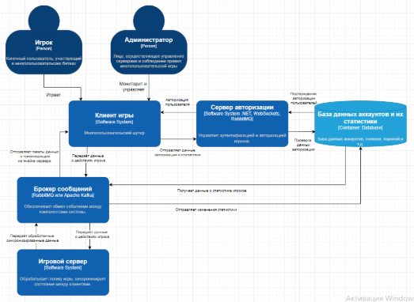
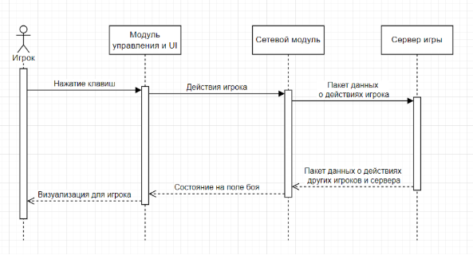
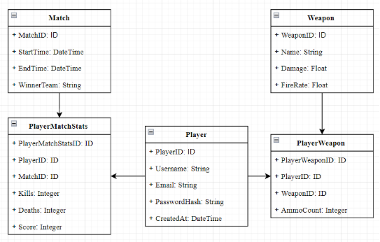

# **Лабораторная работа №3**
# **Диаграмма контейнеров**
**Игровой клиент**:

Отвечает за отображение игры и взаимодействие с игроком.

**Технологии:** Unity, C#.

**Игровой сервер:**

Обрабатывает логику игры, синхронизирует состояние между клиентами.

**Технологии:** .NET, WebSockets, RabbitMQ

**Сервер авторизации:**

Управляет аутентификацией и авторизацией игроков.

**Технологии:** ASP.NET Core, JWT

**База данных:**

Хранит статистику игроков, результаты матчей и данные профилей.

**Технологии:** PostgreSQL или MongoDB.

**Брокер сообщений:**

Обеспечивает обмен событиями между компонентами системы, устраняет проблемы при проседании пинга игроков или мелких разрывах соединения.

**Технологии:** RabbitMQ или Apache Kafka.

## **Диаграмма компонентов**
**Описание**:
Рассмотрим внутреннюю структуру Игрового клиента.

**Компоненты**:

- **Модуль отображения:** Отвечает за рендеринг графики и интерфейса.
- **Модуль управления**: Обрабатывает ввод игрока.
- **Сетевой модуль**: Отправляет и получает данные от сервера.
- **Модуль звука**: Воспроизводит звуковые эффекты и музыку.
- **Модуль локальной логики**: Обрабатывает локальные действия (например, анимации).

**Диаграмма:**

## **Диаграмма последовательностей**
**Описание**:
Рассмотрим последовательность действий игрока и реакцию сервера. 

**Компоненты**:

- **Модуль управления и UI**: Обрабатывает ввод игрока, отвечает за рендеринг графики и интерфейса. В данном случае объединены, так как находятся на одном уровне последовательности.
- **Сетевой модуль**: Отправляет и получает данные от сервера.
- **Сервер игры**: Обрабатывает логику игры, действия ИИ, а также синхронизирует данные игроков.

## **Модель БД**
**Сущности**:

**Player** (Игрок):

Хранит информацию об игроках.

**Атрибуты**:

- PlayerID (ID) — уникальный идентификатор игрока.
- Username (String) — имя игрока.
- Email (String) — электронная почта.
- PasswordHash (String) — хэш пароля.
- CreatedAt (DateTime) — дата регистрации.

**Match (**Матч):

Хранит информацию о матчах.

**Атрибуты**:

- MatchID (ID) — уникальный идентификатор матча.
- StartTime (DateTime) — время начала матча.
- EndTime (DateTime) — время завершения матча.
- WinnerTeam (String) — команда-победитель.

**PlayerMatchStats (**Статистика игрока в матче):

Хранит статистику игрока для конкретного матча.

**Атрибуты**:

- PlayerMatchStatsID (ID) — уникальный идентификатор записи.
- PlayerID (ID) — ссылка на игрока.
- MatchID (ID) — ссылка на матч.
- Kills (Integer) — количество убийств.
- Deaths (Integer) — количество смертей.
- Score (Integer) — общий счёт.

**Weapon** (Оружие):

Хранит информацию об оружии, доступном в игре.

**Атрибуты:**

- WeaponID (ID) — уникальный идентификатор оружия.
- Name (String) — название оружия.
- Damage (Float) — урон оружия.
- FireRate (Float) — скорострельность.

**PlayerWeapon** (Оружие игрока):

Хранит информацию об оружии, которое использует игрок.

Атрибуты:

- PlayerWeaponID (ID) — уникальный идентификатор записи.
- PlayerID (ID) — ссылка на игрока.
- WeaponID (ID) — ссылка на оружие.
- AmmoCount (Integer) — количество патронов.

**Диаграмма:**

## **Применение основных принципов разработки**
**Код:**
**Управление игроком:**

using UnityEngine;

public class PlayerController : MonoBehaviour

{

`    `public float moveSpeed = 5f;

`    `public float rotationSpeed = 10f;

`    `private void Update()

`    `{

`        `HandleMovement();

`        `HandleRotation();

`    `}

`    `private void HandleMovement()

`    `{

`        `float moveX = Input.GetAxis("Horizontal");

`        `float moveZ = Input.GetAxis("Vertical");

`        `Vector3 movement = new Vector3(moveX, 0, moveZ) \* moveSpeed \* Time.deltaTime;

`        `transform.Translate(movement);

`    `}

`    `private void HandleRotation()

`    `{

`        `float mouseX = Input.GetAxis("Mouse X") \* rotationSpeed;

`        `transform.Rotate(0, mouseX, 0);

`    `}

}

**Сетевое взаимодействие:**

using UnityEngine;

using UnityEngine.Networking;

public class NetworkPlayer : NetworkBehaviour

{

`    `public override void OnStartLocalPlayer()

`    `{

`        `base.OnStartLocalPlayer();

`        `GetComponent<PlayerController>().enabled = true;

`    `}

`    `[Command]

`    `public void CmdShoot()

`    `{

`        `// Логика стрельбы на сервере

`        `RpcOnShoot();

`    `}

`    `[ClientRpc]

`    `private void RpcOnShoot()

`    `{

`        `// Логика отображения выстрела на всех клиентах

`        `Debug.Log("Player shot!");

`    `}

}

**Обработка матчей:**

using System;

public class Match

{

`    `public string MatchID { get; set; }

`    `public DateTime StartTime { get; set; }

`    `public DateTime EndTime { get; set; }

`    `public string WinnerTeam { get; set; }

`    `public void StartMatch()

`    `{

`        `StartTime = DateTime.Now;

`        `Console.WriteLine("Match started.");

`    `}

`    `public void EndMatch(string winner)

`    `{

`        `EndTime = DateTime.Now;

`        `WinnerTeam = winner;

`        `Console.WriteLine($"Match ended. Winner: {winner}");

`    `}

}

**Обработка событий:**

using System;

public class EventHandler

{

`    `public void HandlePlayerShoot(string playerID)

`    `{

`        `Console.WriteLine($"Player {playerID} shot.");

`        `// Логика обработки выстрела

`    `}

`    `public void HandlePlayerDeath(string playerID)

`    `{

`        `Console.WriteLine($"Player {playerID} died.");

`        `// Логика обработки смерти

`    `}

}

- **KISS** (Keep It Simple, Stupid)

**Клиент**: Управление игроком реализовано в одном классе PlayerController, который отвечает только за движение и вращение.

**Сервер**: Логика матча и обработка событий разделены на простые методы (StartMatch, EndMatch, HandlePlayerShoot).

- **YAGNI** (You Ain't Gonna Need It)

**Клиент**: Не добавлены сложные функции, такие как прыжки или приседания, так как они не требуются для прототипа.

**Сервер**: Не реализованы дополнительные функции, такие как система достижений, так как они не входят в MVP.

- **DRY** (Don't Repeat Yourself)

**Клиент**: Логика движения и вращения вынесена в отдельные методы (HandleMovement, HandleRotation), чтобы избежать дублирования кода.

**Сервер**: Обработка событий вынесена в отдельный класс EventHandler, чтобы избежать дублирования кода в разных частях сервера.

- **SOLID**
  - **Single Responsibility Principle (SRP):**

Класс PlayerController отвечает только за управление игроком.

Класс Match отвечает только за управление матчем.

- **Open/Closed Principle (OCP):**

Класс EventHandler можно расширять, добавляя новые методы для обработки событий, не изменяя существующий код.

- **Liskov Substitution Principle (LSP):**

Если в будущем появятся новые типы игроков (например, боты), они смогут использовать те же методы, что и обычные игроки.

- **Interface Segregation Principle (ISP):**

Интерфейсы не используются в данном примере, но в будущем можно выделить интерфейсы для управления игроком и обработки событий.

- **Dependency Inversion Principle (DIP):**

Класс EventHandler не зависит от конкретных реализаций, что позволяет легко заменять его на другую реализацию.
## **Дополнительные принципы разработки**
1. # **BDUF (Big Design Up Front — «Масштабное проектирование прежде всего»)**

   **Описание**:

   **BDUF** предполагает тщательное проектирование всей системы перед началом разработки. Все требования, архитектура и дизайн должны быть детально проработаны до написания кода.

   **Преимущества**:

- Позволяет избежать ошибок на ранних этапах.
- Чёткое понимание требований и архитектуры.

**Недостатки**:

- Требует значительных временных и ресурсных затрат на проектирование
- Может быть избыточным для небольших проектов или прототипов.

**Отказ**: Проект представляет собой прототип, а не полноценный продукт. BDUF избыточен, так как прототип предполагает быструю реализацию и итеративное улучшение.

**Альтернатива**: Использование гибких методологий (например, Agile) с поэтапным проектированием.
# **2. SoC (Separation of Concerns — «Принцип разделения ответственности»)**

**Описание**:
**SoC** предполагает разделение системы на независимые модули, каждый из которых отвечает за определённую функциональность. Это упрощает разработку, тестирование и поддержку.

**Преимущества**:

- Упрощает разработку и тестирование.
- Повышает читаемость и поддерживаемость кода.
- Позволяет повторно использовать модули.

**Недостатки**:

- Требует дополнительных усилий для проектирования интерфейсов между модулями.

**Применимо**: Проект многопользовательского шутера включает несколько независимых компонентов (например, управление отрядом, ИИ, сетевое взаимодействие). Разделение ответственности между этими компонентами упрощает разработку и позволяет независимо тестировать и улучшать каждый модуль.

**Пример**:

Сетевой модуль отвечает только за передачу данных.

Модуль ИИ отвечает только за поведение ботов.

# **3. MVP (Minimum Viable Product — «Минимально жизнеспособный продукт»)**

**Описание**:
**MVP** предполагает создание продукта с минимальным набором функций, достаточным для тестирования гипотез и получения обратной связи от пользователей.

**Преимущества**:

- Позволяет быстро выйти на рынок и получить обратную связь.
- Снижает затраты на разработку.
- Позволяет итеративно улучшать продукт.

**Недостатки**:

- Может не удовлетворить ожидания пользователей, если функциональность слишком ограничена.

**Применимо**: Прототип многопользовательского шутера — это идеальный кандидат для MVP. Основные функции (управление отрядом, стрельба, перемещение, сетевое взаимодействие) могут быть реализованы в минимальном виде для тестирования и получения обратной связи.

**Пример MVP для проекта:**

- Один уровень с базовыми механиками.
- Поддержка 2-4 игроков в сетевом режиме.
- Простой ИИ для ботов.
  Простая система стрельбы.
# **4. PoC (Proof of Concept — «Доказательство концепции»)**
**Описание:**
**PoC** — это реализация ключевой идеи или технологии для проверки её жизнеспособности. Обычно это небольшой прототип, который демонстрирует, что концепция работает.

Преимущества:

- Позволяет проверить сложные или рискованные идеи до полной реализации.
- Снижает риски и затраты на разработку.

**Недостатки**:

- Не является полноценным продуктом и требует дальнейшей разработки.

**Применимо:** Для многопользовательского шутера PoC может быть использован для проверки ключевых технологий, таких как сетевая синхронизация или ИИ для ботов.

**Пример PoC для проекта:**

- Реализация базового сетевого взаимодействия между двумя клиентами.
- Демонстрация простого ИИ, который может атаковать и укрываться.

# **Итог**
1. **BDUF**: Не применим для прототипа, так как требует избыточного проектирования.
1. **SoC**: Применим, так как упрощает разработку и поддержку модулей.
1. **MVP**: Применим, так как позволяет быстро создать прототип и получить обратную связь.
1. **PoC**: Применим для проверки ключевых технологий (сетевое взаимодействие, ИИ).

