# **1. Принятые проектные решения**
1. Использование RESTful API:
- API построен на принципах REST, что обеспечивает простоту и понятность взаимодействия с сервером.
- Используются стандартные HTTP-методы: GET, POST, PUT, DELETE.
1. JSON как формат данных:
- Все запросы и ответы передаются в формате JSON для удобства обработки на клиенте и сервере.
1. Авторизация через JWT:
- Для защиты API используется JWT (JSON Web Token), который передаётся в заголовке Authorization.
1. Версионирование API:
- Все эндпоинты начинаются с префикса /api/v1/, что позволяет в будущем добавлять новые версии API без нарушения работы существующих клиентов.
1. Идемпотентность методов:
- Методы PUT и DELETE являются идемпотентными, то есть повторный вызов с теми же данными не изменяет состояние системы.
1. Обработка ошибок:
- Все ошибки возвращаются с соответствующими HTTP-кодами и описанием в теле ответа. Например:

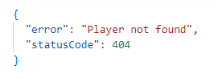

1. Пагинация для списков:
- Методы, возвращающие списки (например, список игроков), поддерживают пагинацию через параметры limit и offset.
1. Логирование запросов:
- Все запросы логируются на сервере для упрощения отладки и анализа.

# **2. Описание эндпоинтов**
### **2.1. Игроки**
#### **GET /api/v1/players**
**Описание**: Получить список всех игроков.

**Параметры**:

- limit (опционально): Количество игроков на странице (по умолчанию 10).
- offset (опционально): Смещение (по умолчанию 0).

**Ответ**:

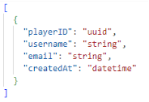
#### **GET /api/v1/players/{playerID}**
**Описание**: Получить информацию об игроке по ID.

**Ответ:**

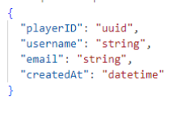

#### **POST /api/v1/players**
**Описание**: Создать нового игрока.

**Тело запроса:**

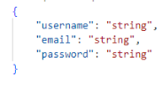

**Ответ:**
#### 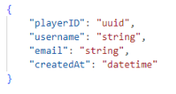
#### **PUT /api/v1/players/{playerID}**
**Описание**: Обновить информацию об игроке.

**Тело запроса:**

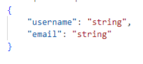

**Ответ:**

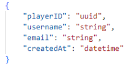
#### **DELETE /api/v1/players/{playerID}**
**Описание**: Удалить игрока по ID.

**Ответ**:
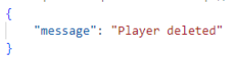
###
### **2.2. Матчи**
#### **GET /api/v1/matches**
**Описание**: Получить список всех матчей.

**Параметры**:

- **limit** (опционально): Количество матчей на странице (по умолчанию 10).
- **offset** (опционально): Смещение (по умолчанию 0).

**Ответ**:
#### 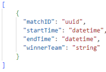
### **POST /api/v1/matches**
**Описание**: Создать новый матч.

**Тело запроса:**

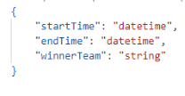

**Ответ**:
### 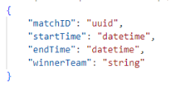

### **3. Реализация API**
Пример реализации на C# с использованием ASP.NET Core:

[ApiController]

[Route("api/v1/[controller]")]

public class PlayersController : ControllerBase

{

`    `private readonly List<Player> \_players = new();

`    `[HttpGet]

`    `public IActionResult GetPlayers(int limit = 10, int offset = 0)

`    `{

`        `var result = \_players.Skip(offset).Take(limit).ToList();

`        `return Ok(result);

`    `}

`    `[HttpGet("{playerID}")]

`    `public IActionResult GetPlayer(string playerID)

`    `{

`        `var player = \_players.FirstOrDefault(p => p.PlayerID == playerID);

`        `if (player == null) return NotFound(new { error = "Player not found", statusCode = 404 });

`        `return Ok(player);

`    `}

`    `[HttpPost]

`    `public IActionResult CreatePlayer([FromBody] Player player)

`    `{

`        `player.PlayerID = Guid.NewGuid().ToString();

`        `player.CreatedAt = DateTime.UtcNow;

`        `\_players.Add(player);

`        `return Ok(player);

`    `}

`    `[HttpPut("{playerID}")]

`    `public IActionResult UpdatePlayer(string playerID, [FromBody] Player updatedPlayer)

`    `{

`        `var player = \_players.FirstOrDefault(p => p.PlayerID == playerID);

`        `if (player == null) return NotFound(new { error = "Player not found", statusCode = 404 });

`        `player.Username = updatedPlayer.Username;

`        `player.Email = updatedPlayer.Email;

`        `return Ok(player);

`    `}

`    `[HttpDelete("{playerID}")]

`    `public IActionResult DeletePlayer(string playerID)

`    `{

`        `var player = \_players.FirstOrDefault(p => p.PlayerID == playerID);

`        `if (player == null) return NotFound(new { error = "Player not found", statusCode = 404 });

`        `\_players.Remove(player);

`        `return Ok(new { message = "Player deleted" });

`    `}

}

