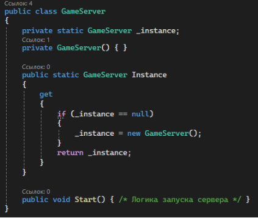
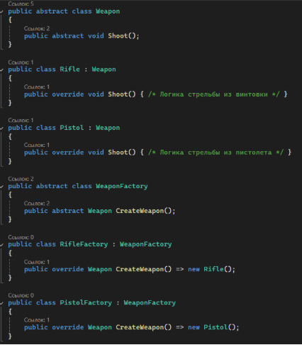
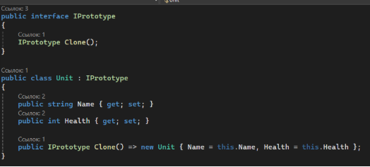

# **Шаблоны проектирования GoF**
### **Порождающие шаблоны**
1. ### **Singleton (Одиночка)**
**Описание**:

Обеспечивает создание только одного экземпляра класса и предоставляет глобальную точку доступа к этому экземпляру.

**Использование:** Для управления игровым сервером или базой данных, где требуется единственный экземпляр.

**Пример:**

1. ### **Factory Method (Фабричный метод)**
**Описание**:

Определяет интерфейс для создания объекта, но позволяет подклассам изменять тип создаваемого объекта.

**Использование:**  Для создания различных типов оружия или юнитов.

**Пример:**

1. ### **Prototype (Прототип)**

**Описание**:

Позволяет копировать существующие объекты без создания зависимостей от их классов.

**Использование:** Для создания копий юнитов или оружия с минимальными затратами ресурсов

**Пример:**

### **Структурные шаблоны**
<Представить с пояснения по каждому шаблону, указав название и назначение, сопроводив UML-диаграммой и соответствующим фрагментом программного кода>

1. 1
1. 2
1. 3
1. 4

### **Поведенческие шаблоны**
<Представить с пояснения по каждому шаблону, указав название и назначение, сопроводив UML-диаграммой и соответствующим фрагментом программного кода>

1. 1
1. 2
1. 3
1. 4
1. 5

